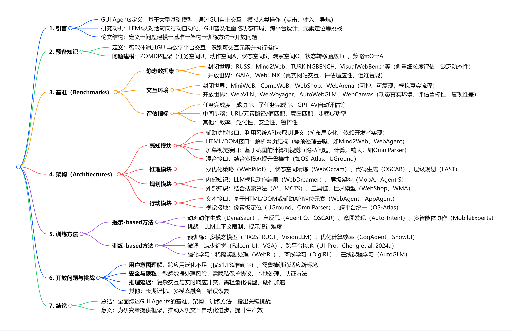

# GUI Agents: A Survey

## 思维导图

## 主要内容

1. **作者和团队信息**

**作者**：Dang Nguyen（马里兰大学）、Jian Chen（纽约州立大学布法罗分校）、Yu Wang（俄勒冈大学）、Gang Wu（Adobe Research）等共 33 位作者，来自 11 个机构，包括高校（如加州大学圣地亚哥分校、卡内基梅隆大学）、企业实验室（如 Adobe Research、Meta AI、Intel AI Research）等。   

**团队简介**：主要作者 Dang Nguyen（马里兰大学）和 Gang Wu（Adobe Research）长期从事智能代理与 GUI 交互研究，团队整合了计算机视觉、自然语言处理和人机交互领域的专家，致力于推动 GUI 代理的系统性研究。

2. **背景和动机**

**发表时间**：2024 年 12 月（arXiv 预印本）

**研究问题**：基于大型基础模型（LFMs）的 GUI 代理如何高效、鲁棒地通过图形用户界面（GUI）自动化人机交互？

**背景与契机**：

- LFMs 从对话式聊天机器人转向任务执行代理，GUI 作为人机交互的核心界面，其自动化需求日益增长。
  
- GUI 环境存在动态布局、跨平台多样性、元素细粒度定位等挑战，现有研究分散，缺乏统一框架。
  
- 工业界（如 Anthropic、OpenAI）对 GUI 代理兴趣浓厚，但学术界尚未形成系统性总结。

3. **相关研究**

**前人方法**：

- **基准构建**：静态数据集（如 RUSS、Mind2Web）和交互环境（如 MiniWoB、WebShop）用于评估代理性能，但封闭世界假设限制泛化性，开放世界环境复现困难。

- **架构设计**：感知模块依赖辅助功能 API、HTML/DOM 解析或屏幕视觉；规划模块结合 LLM 内部知识或外部工具（如 A * 搜索）；行动模块通过文本或视觉接地执行操作。

- **训练方法**：提示工程（动态动作生成、自反思）和参数优化（预训练、微调、强化学习）提升代理能力。

**不足**：

- 缺乏统一框架整合感知、推理、规划、行动能力。

- 开放世界场景下的用户意图理解、安全隐私、推理延迟等问题未充分解决。

- 现有评估指标侧重任务完成度，缺乏对中间步骤和鲁棒性的细粒度分析。

4. **核心思路**

**核心思想**：提出 GUI 代理的统一框架，将其能力划分为 **感知**、**推理**、**规划**、**行动** 四大模块，系统分类现有基准、架构和训练方法，并识别关键挑战。

**Idea 来源**：

- 观察到 GUI 代理需模仿人类通过视觉和交互操作完成任务，需整合多模态感知（视觉、文本）与决策推理。

- 借鉴强化学习（POMDP 建模）和 LLM 驱动的代理架构，结合 GUI 交互的独特需求（如元素定位、跨平台适配）。

5. **方案和技术**

**基准分类**

静态数据集：

  封闭世界（如 TURKINGBENCH）：细粒度评估，复现性强，但缺乏动态性。

  开放世界（如 GAIA）：真实网站交互，评估适应性，难复现。
  
交互环境：

封闭世界（如 WebArena）：可控模拟，支持多步骤工作流。

开放世界（如 WebVoyager）：动态真实环境，考验鲁棒性。

评估指标：任务完成率、中间步骤精度（URL / 元素匹配）、效率、安全性。

架构设计

感知模块：

辅助功能 API（系统级语义解析，如 Android Accessibility API）。

HTML/DOM 解析（网页结构分析，如 Mind2Web 的 DOM 排名）。

屏幕视觉（截图识别，如 GPT-4V 解析 UI 元素）。

混合接口（多模态融合，如 OS-Atlas 结合视觉与文本）。

推理与规划：

内部知识：LLM 模拟动作结果（WebDreamer）、层级规划（MobA）。

外部知识：结合搜索算法（A*、MCTS）或工具链（Toolchain*）。

行动模块：

文本接地（基于 DOM/API 定位元素）或视觉接地（像素级坐标定位）。

训练方法

提示 - based：动态生成 Python 代码（DynaSaur）、自反思优化（Agent Q）。

训练 - based：

预训练：多模态模型（如 PIX2STRUCT 解析截图）。

微调：减少幻觉（Falcon-UI）、跨平台接地（UGround）。

强化学习：处理稀疏奖励（WebRL）、在线课程学习（AutoGLM）。

6. 实验和总结
实验设计：
综述性论文，无具体实验，而是整理现有基准的评估结果（如 WebVoyager 任务完成率 85.3%，与人类判断一致）、架构对比（混合接口优于单一模态）、训练方法效果（强化学习提升长期任务表现）。
结论：
GUI 代理在封闭世界任务中表现良好，但开放世界的泛化性、安全性和效率仍需提升。
统一框架为后续研究提供系统性指导，多模态融合和轻量化模型是关键方向。
7. 主要贡献
统一框架：首次将 GUI 代理划分为感知、推理、规划、行动四大模块，明确各模块技术路径。
基准分类：系统整理 30 + 数据集和环境，区分封闭 / 开放世界场景，提供评估指标体系。
挑战识别：指出用户意图理解、安全隐私、推理延迟等关键问题，为未来研究指明方向。
8. 不足与未来方向
不足：
未涵盖命令行接口（CLI）和 API 驱动的代理，聚焦 GUI 场景。
对长期记忆、多智能体协作等前沿方向讨论有限。
未来方向：
提升开放世界泛化性，研究小样本适应和动态环境鲁棒性。
开发隐私保护技术（如联邦学习、本地计算），降低数据传输风险。
优化模型效率，结合硬件加速实现实时交互。
