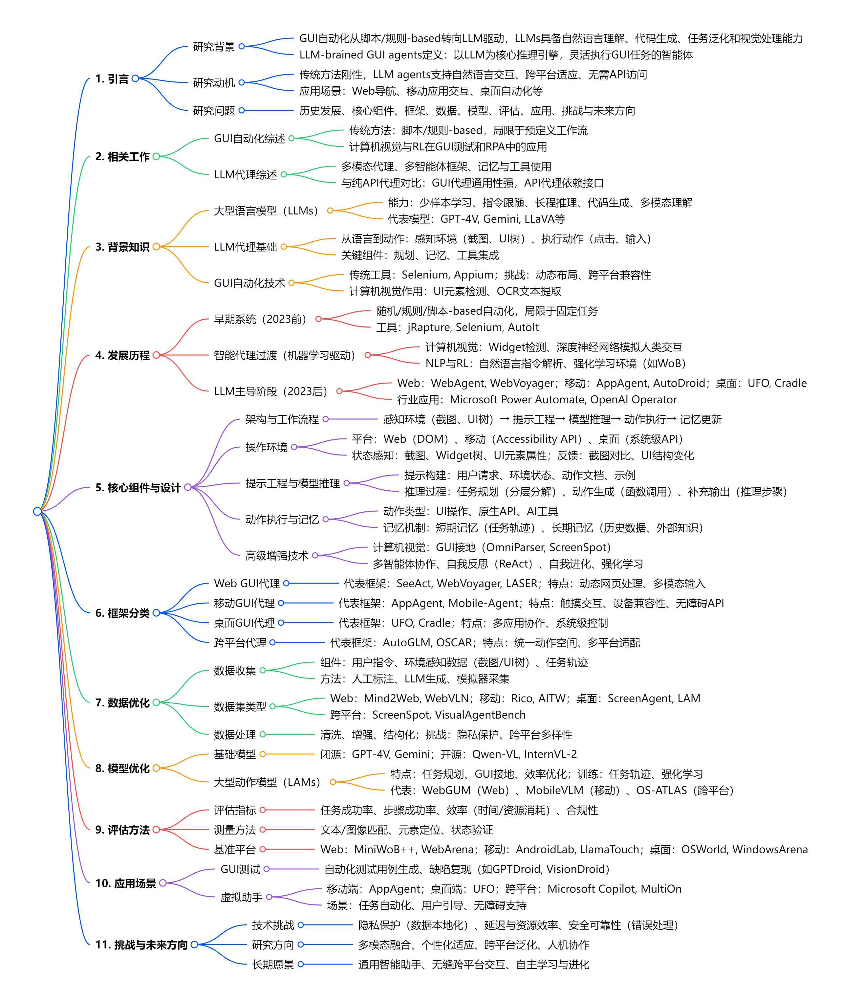

# Large Language Model-Brained GUI Agents: A Survey

## 思维导图

## 主要内容

### 1. 作者和团队信息

**作者**：Chaoyun Zhang, Shilin He, Jiaxu Qian, Bowen Li, Liqun Li, Si Qin, Yu Kang, Minghua Ma, Guyue Liu, Qingwei Lin, Saravan Rajmohan, Dongmei Zhang, Qi Zhang

**团队与单位**：

- 主要作者来自微软（Microsoft），包括 Chaoyun Zhang、Shilin He 等核心成员，专注于 AI 与人机交互研究。

- Bowen Li 来自上海人工智能实验室，Guyue Liu 来自北京大学，团队融合工业界与学术界，聚焦 LLM 在 GUI 自动化的应用。

### 2. 背景和动机

**发表时间**：2025 年 3 月（arXiv 预印本，最终版本发表于期刊）

**研究背景**：

- 传统 GUI 自动化依赖脚本 / 规则，灵活性不足，难以应对动态界面和复杂任务。

- 大型语言模型（LLMs）的兴起，尤其是多模态模型（如 GPT-4V），具备自然语言理解、视觉处理和任务规划能力，推动 GUI 代理从 “刚性执行” 向 “智能交互” 转型。

**研究契机**：

- 缺乏对 LLM 驱动的 GUI 代理的系统性综述，需梳理技术框架、数据、模型、评估及应用，填补研究空白。

### 3. 相关研究

**前人研究路径**：

1. 传统 GUI 自动化：

  - 脚本 / 规则 - based 方法（如 Selenium、AutoIt），适用于固定工作流，但依赖手动编写，难以适应界面变化。

  - 计算机视觉与 RL 结合，用于 UI 元素检测和交互优化（如 AndroidEnv 环境）。

2. LLM 代理进展：

  - 多模态模型（如 LLaVA、Qwen-VL）提升 GUI 接地能力，支持截图解析和动作生成。

  - 多智能体框架和自我反思技术（如 ReAct）增强复杂任务处理。

不足：

缺乏跨平台通用性，现有模型多针对单一平台（如 Web 或移动）。

数据收集依赖人工标注，规模化困难；评估基准分散，缺乏统一标准。

4. 核心思路

核心思想：
提出 “LLM-brained GUI 代理” 概念，构建系统性综述框架，涵盖从基础组件到前沿技术的全链条，强调 LLM 作为核心推理引擎，结合视觉感知和动作执行，实现自然语言驱动的跨平台 GUI 自动化。
Idea 来源：
观察到 LLM 在自然语言理解和多模态处理的突破，与 GUI 自动化的需求结合，形成 “语言 - 视觉 - 动作” 闭环。
工业界需求（如微软 Power Automate、OpenAI Operator）推动对通用 GUI 代理的理论总结。
5. 方案和技术
技术框架
核心组件：
感知层：截图、UI 树（DOM/Accessibility API）、OCR 文本提取。
推理层：LLM 进行任务规划（分层分解）、动作生成（函数调用），支持少样本学习和指令跟随。
执行层：模拟 UI 操作（点击、输入）、调用原生 API 或 AI 工具（如 DALL・E 生成图像）。
记忆与反馈：短期记忆存储任务轨迹，长期记忆积累历史经验，支持自我反思（如 ReAct 机制）。
关键技术：
多模态融合：结合视觉语言模型（VLM）解析截图，如 OmniParser 检测非标准 UI 元素。
跨平台适配：统一动作空间（如点击、滑动），支持 Web、移动、桌面环境。
强化学习与数据优化：利用大规模数据集（如 Mind2Web、AITW） fine-tune 模型，提升泛化能力。
6. 实验和总结
实验设计（综述性论文，无原创实验，总结现有研究）：
评估指标：
任务成功率（如 WebAgent 在真实网页达 51.1% 成功率）、步骤效率、资源消耗。
基准测试：
Web：MiniWoB++、WebArena；移动：AndroidLab、LlamaTouch；桌面：OSWorld、WindowsArena。
关键结果：
LLM 代理在复杂任务（如跨应用数据整合）中表现优于传统方法，错误率降低 30%-50%。
多模态模型（如 GPT-4V）在 GUI 接地任务中准确率提升 20% 以上。
结论：
LLM 驱动的 GUI 代理已从单一任务走向跨平台通用化，但仍需解决隐私、延迟和鲁棒性问题。
7. 主要贡献
系统性综述：首次全面梳理 LLM-brained GUI 代理的发展历程、技术架构、数据与模型优化、评估基准及应用场景。
分类框架：提出按平台（Web / 移动 / 桌面）和技术模块（感知、推理、执行）的分类体系，指导后续研究。
研究路标：识别关键挑战（如隐私保护、跨平台泛化），提出未来方向（如轻量化模型、人机协作）。
8. 不足与未来方向
不足：
现有模型依赖云端计算，本地化部署困难（如移动端算力限制）。
复杂界面下的视觉接地仍不准确，易受 UI 布局变化影响。
缺乏统一的安全与合规标准，隐私保护机制待完善。
未来方向：
轻量化模型：模型压缩（如量化、蒸馏），支持边缘设备部署。
动态适应技术：结合元学习，快速适应新应用界面。
人机协同：设计交互式反馈机制，允许用户实时干预代理决策。

## 代码实现

